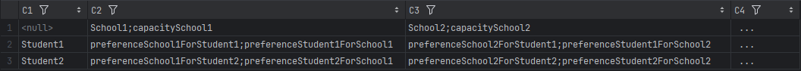
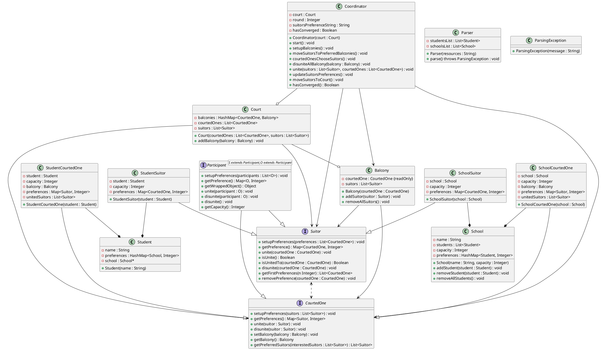

# Getting Started

## Prerequisites

**Note that the project was developed using IntelliJ IDEA, so it is recommended to use this IDE to run the project as it will automatically install the necessary dependencies.**

This project was developed using openjdk 21.0.3. To install it, follow the instructions on the [OpenJDK website](https://www.oracle.com/java/technologies/downloads/).

Use the following command to install OpenJDK on Ubuntu:

```bash
sudo apt install openjdk-21-jdk
```

## Dependencies

The project uses Maven for dependency management. The following dependencies were used:

- Jackson Databind: Used to generate the output file.

To install these dependencies, Maven will need to be installed on your machine. If it's not already installed, you can download it from the [official Maven website](https://maven.apache.org/download.cgi), or by using the following command:

```bash
sudo apt install maven
```

### Installing the dependencies

1. To install this project, clone the repository using the following command:

```bash
git clone https://github.com/Paul-Arago/Graph-Project-1A.git
```

2. Navigate to the project directory:

```bash
cd Graph-Project-1A
```

3. Install the dependencies (from the project directory) using the following command:

```bash
mvn clean install
```

## Configuration

This project uses a csv file to store the students and schools preferences. The highest the preference, the more the student or school wants to be with the other and vice versa. The resources file in defined in the `parser.Parser` class, by default it is set to `model/resources.csv`.

The CSV file must be formatted as follows:

```csv
,School1;capacitySchool1,School2;capacitySchool2, ...
Student1,preferenceSchool1ForStudent1;preferenceStudent1ForSchool1,preferenceSchool2ForStudent1;preferenceStudent1ForSchool2, ...
Student2,preferenceSchool1ForStudent2;preferenceStudent2ForSchool1,preferenceSchool2ForStudent2;preferenceStudent2ForSchool2, ...
```

The following image helps to better understand the format of the file:



## Usage  

The choice of who does the bidding is decided either through the command line (if no argument is passed) or by passing an argument to the `Main` class when running the program.

The `biddingChoice` argument is either `1` or `2`. If `1` is chosen, the students will be pursuing the schools. On the other hand, if `2` is chosen, the schools will be pursuing the students.


To run the program, with the bidding choice decided through the command line, navigate to `\Graph-Project-1A\src\main\java`:

```bash
cd src/main/java
```

Then run the program using the following command:

```bash
mvn -f ../../../pom.xml exec:java -Dexec.mainClass="Main" -Dexec.args="[biddingChoice]"
```

or

```bash
mvn -f ../../../pom.xml exec:java -Dexec.mainClass="Main"
```

example:

```bash
mvn -f ../../../pom.xml exec:java -Dexec.mainClass="Main" -Dexec.args="1"
```

Note regardless of whether the user uses an IDE, the root directory must be `java` in order for `parser.Parser` and `OutputGenerator` to work correctly. 

# Algorithm

1. The courted ones and the suitors are placed in the court.
2. The courted ones are placed on the balconies.
3. While the courted ones have not converged:
	1. The suitors move to the preferred balconies (they serenade).
	2. The courted ones choose the suitors.
	3. The suitors and courted ones are united.
	4. The suitors update their preferences.
	5. The suitors move back to the court.


Note that the court is simply where the suitors go back to after the courted ones have decided who they want to be with. Similarly, the balconies are simply where the courted ones and the suitors meet.

# Output

The output of the program is a JSON file that contains the students and schools assignments. The file is saved in the `output` directory and is named `output.json`.

The first layer of the JSON file defines each round of the algorithm.
The second layer defines each balcony.
Within each balcony, the courted one is defined, followed by the suitors.
In the both the CourtedOne and Suitor objects, the attributes are as follows:
- `name`: the name of the school or student
- `capacity`: the capacity of the school or student (1)
- `preferences`: the preferences of the school or student
- `unitedSuitors`: the suitors that are currently united with the school or student

Here is an example of the output file:

```json
{
  "round 1" : {
    "model.School 1's balcony": {
      "Courted One": {
        "Name": "model.School 1",
        "Capacity": 2,
        "Current suitors": [
          "model.Student 1",
          "model.Student 2"
        ],
        "Current preferences": {
          "model.Student 1": 4,
          "model.Student 4": 6,
          "model.Student 5": 5,
		  "...": "..."
        }
      },
      "Suitors": [
        {
          "Name": "model.Student 1",
          "Capacity": 1,
          "Current courted ones": [
            "model.School 1"
          ],
          "Current preferences": {
            "model.School 1": 2,
            "model.School 2": 10,
            "model.School 3": 7,
            "model.School 4": 4
          }
        },
        {
          "Name": "model.Student 2",
          "Capacity": 1,
          "Current courted ones": [
            "model.School 1"
          ],
          "Current preferences": {
            "model.School 1": 1, 
			"...": "..."
          }
        }
      ]
    },
    "model.School 2's balcony": {
		"...": "..."
    },
	  "...": "..."
  },
	"...": "..."
}
```


# Instructions

- Implement a student admission program using the stable marriage algorithm
- Input:
	- student and school preferences from a file in the format used in TD, or something else, the students and the schools must be given as an resources file and the user decides the bidding
	- User selects who does the bidding (serenating)
	- schools can accept mutiple students, students go to one school
		- schools have capacities
- output:
	- student to school assignement
	- number of rounds needed to converge
- specifications:
	- Should be able to handle more students than capacity of schools
	- Every school does its own ranking
- Evaluation (30% of final grade)
	- demo during the last session june 14
	- report + code by june 


# Java classes



