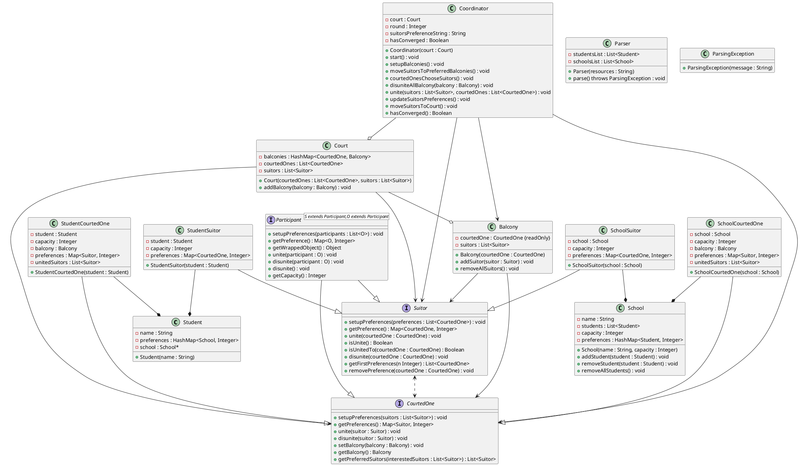

# Getting Started

## Prerequisites

This project was developed using openjdk 22.0.1. To install it, follow the instructions on the [OpenJDK website](https://www.oracle.com/java/technologies/downloads/).

Only basic `Java.util`, `Java.io` and `Java.nio` libraries were used in this project. No additional libraries are required to run this project.

## Installation

To install this project, clone the repository using the following command:

```bash
git clone https://github.com/Paul-Arago/Graph-Project-1A.git
```

## Configuration

This project uses a csv file to store the students and schools preferences. The highest the preference, the more the student or school wants to be with the other and vice versa. The resources file in defined in the `parser.Parser` class, by default it is set to `model/resources.csv`.

The CSV file must be formatted as follows:

```csv
,School1;capacitySchool1,School2;capacitySchool2, ...
Student1,preferenceSchool1ForStudent1;preferenceStudent1ForSchool1,preferenceSchool2ForStudent1;preferenceStudent1ForSchool2, ...
Student2,preferenceSchool1ForStudent2;preferenceStudent2ForSchool1,preferenceSchool2ForStudent2;preferenceStudent2ForSchool2, ...
```

The following image helps to better understand the format of the file:


## Usage  

The `biddingChoice` is either `1` or `2`. If `1` is chosen, the students will be pursuing the schools. On the other hand, if `2` is chosen, the schools will be pursuing the students.

The choice of who does the bidding is decided either through the command line or by passing an argument to the `Main` class when running the program.

To run the program, with the bidding choice decided through the command line, use the following command:

```bash
java Main [biddingChoice]
```

example:

```bash
java Main 1
```

If a bidding choice is not provided, the program will prompt the user to enter a choice.

Note that wether or not the user uses an IDE, the root directory must be `src` in order for the `parser.Parser` class to find the resources file.

# Instructions

- Implement a student admission program using the stable marriage algorithm
- Input:
	- student and school preferences from a file in the format used in TD, or something else, the students and the schools must be given as an resources file and the user decides the bidding
	- User selects who does the bidding (serenating)
	- schools can accept mutiple students, students go to one school
		- schools have capacities
- output:
	- student to school assignement
	- number of rounds needed to converge
- specifications:
	- Should be able to handle more students than capacity of schools
	- Every school does its own ranking
- Evaluation (30% of final grade)
	- demo during the last session june 14
	- report + code by june 


# Java classes



# Algorithm

## Logic

The seekers is the party that is looking for a match.
The responders are the party that is being sought after.

At the very beginning all of the seekers are placed in the court.

From here day 1 starts.

The seekers are moved to the balcony based on their preferences.

The responders are choose a seeker based on their preferences.

The seekers are moved back to the court.

From here day 2 starts.

...


## Pseudo code

```


```


