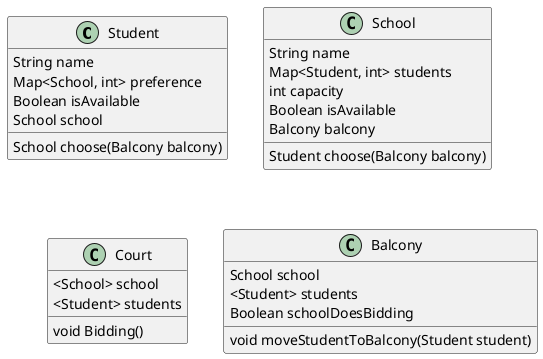

# Java classes



# Algorithm

## Logic

### The schools do the bidding

### The students do the bidding

The students go to the school they prefer the most.
When a student goes to a school, the school checks if it has capacity.
If it does, the student with the highest preference is added to the school.


## Pseudo code

```


```


