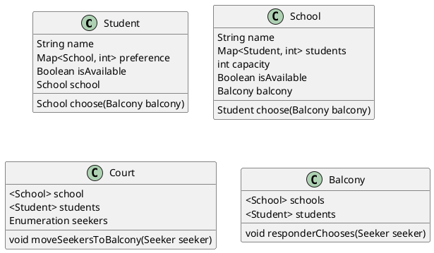

# Java classes



# Algorithm

## Logic

The seekers is the party that is looking for a match.
The responders are the party that is being sought after.

At the very beginning all of the seekers are placed in the court.

From here day 1 starts.

The seekers are moved to the balcony based on their preferences.

The responders are choose a seeker based on their preferences.

The seekers are moved back to the court.

From here day 2 starts.

...


## Pseudo code

```


```


